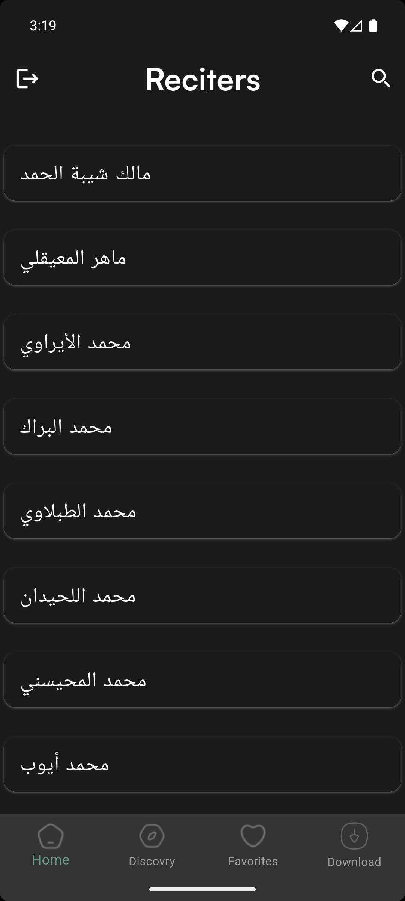
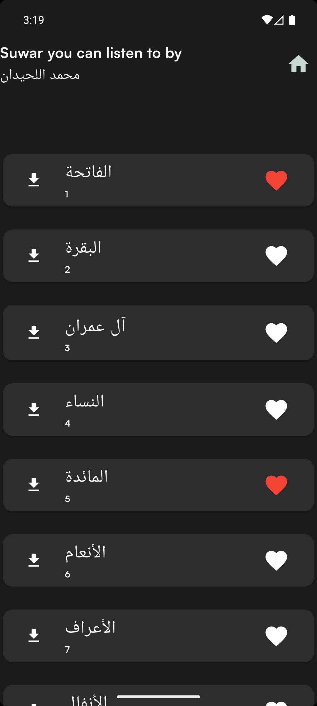
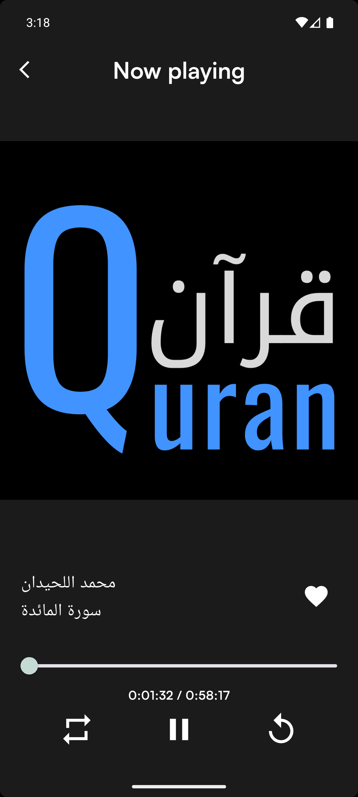
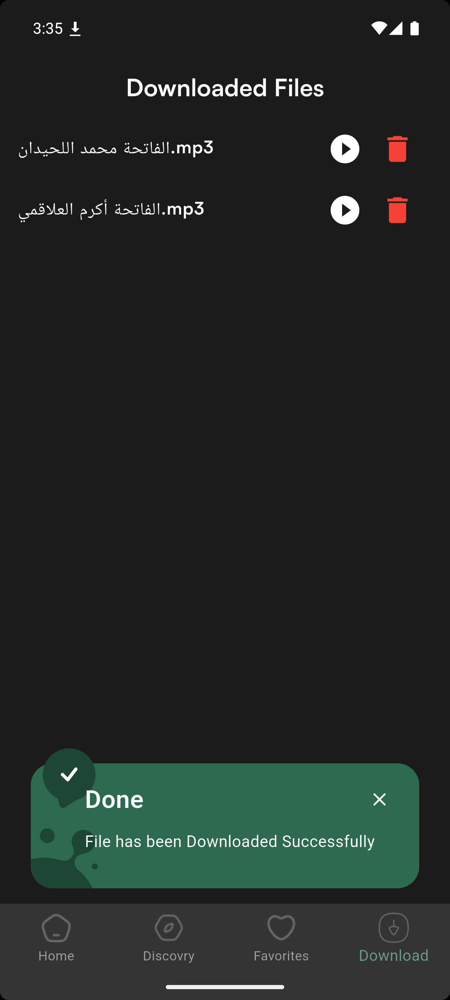

# 📖 Quran MP3 App

**Quran MP3** is a Flutter-based mobile application that allows users to listen to high-quality audio recitations of the Holy Quran.  
It features an intuitive interface, smooth playback controls, and support for background audio playback.

---

## ✨ Features

- 🎧 Play Quran surahs in high-quality MP3 format.
- 📂 Play from local storage or stream from the internet.
- ▶️ Full playback controls (play, pause, stop).
- ⏮️ Skip between surahs or audio tracks.
- 📱 Responsive design for all screen sizes.
- 🌙 Dark Mode support.

---

## 🛠️ Tech Stack & Packages

- [Flutter](https://flutter.dev) — Main framework.
- [audioplayers](https://pub.dev/packages/audioplayers) — Audio playback.
- [flutter_media_metadata](https://pub.dev/packages/flutter_media_metadata) — Read audio file metadata.
- [permission_handler](https://pub.dev/packages/permission_handler) — Request storage permissions.
- [flutter_file_downloader](https://pub.dev/packages/flutter_file_downloader) — Download MP3 files.

---

## 📸 Screenshots

Here are some screenshots of the Quran MP3 App:

| Reciter Screen                               | Surah Screen                             | Play Screen                            | Download Screen                                |
| -------------------------------------------- | ---------------------------------------- | -------------------------------------- | ---------------------------------------------- |
|  |  |  |  |

---

## 🚀 Getting Started

### 1️⃣ Clone the repository

```bash
git clone https://github.com/Ahmed4r/mp3App.git
cd mp3App
```
